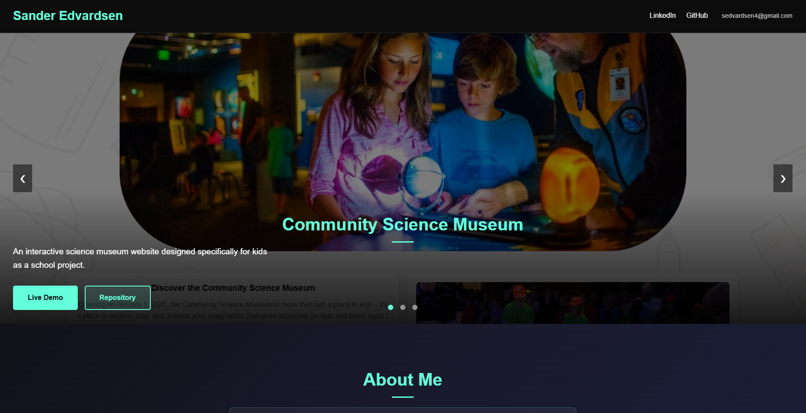

# Sander Edvardsen - Portfolio



A personal portfolio website showcasing my frontend development projects, skills, and contact information.

## Description

This project is a modern, responsive portfolio website built to highlight my work as a frontend development student at Noroff School of Technology and Digital Media. The site features a carousel of selected projects, an about section, a skills grid, and contact links.

Key features:
- Interactive carousel banner with project highlights
- Clean, modern, and responsive design
- Skills section with technology icons
- Easy access to contact and social links

## Built With

- HTML5
- CSS3
- JavaScript

## Getting Started

### Installing

To get a local copy up and running, follow these simple steps:

1. Clone the repository:

```bash
git clone https://github.com/sanderedvardsen/POR1-upgrade-resit.git
```

2. Open the folder in your code editor.

### Running

Simply open `index.html` in your web browser. No build tools or dependencies are required.


## Contact

- [GitHub](https://github.com/sanderedvardsen)
- [LinkedIn](https://linkedin.com/in/sanderedvardsen)
- Email: sedvardsen4@gmail.com

## License

This project is open source and available under the [MIT License](LICENSE) (add a LICENSE file if you wish).

## Acknowledgments

- Noroff School of Technology and Digital Media
- [Devicon](https://devicon.dev/) for skill icons
- Inspiration from fellow students and the developer community
